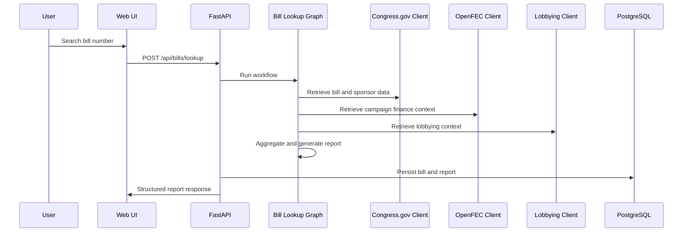
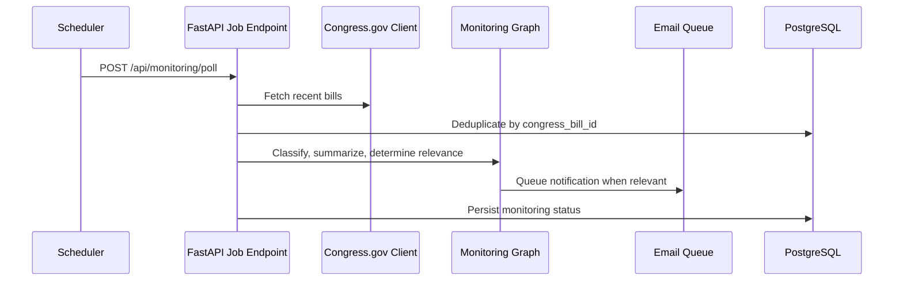

# Data Flow Diagram

## Bill Intelligence

```mermaid
sequenceDiagram
  participant U as User
  participant W as Web UI
  participant A as FastAPI
  participant G as Bill Lookup Graph
  participant C as Congress.gov Client
  participant F as OpenFEC Client
  participant L as Lobbying Client
  participant D as PostgreSQL

  U->>W: Search bill number
  W->>A: POST /api/bills/lookup
  A->>G: Run workflow
  G->>C: Retrieve bill and sponsor data
  G->>F: Retrieve campaign finance context
  G->>L: Retrieve lobbying context
  G->>G: Aggregate and generate report
  A->>D: Persist bill and report
  A->>W: Structured report response
```

## Automated Monitoring

```mermaid
sequenceDiagram
  participant S as Scheduler
  participant A as FastAPI Job Endpoint
  participant C as Congress.gov Client
  participant G as Monitoring Graph
  participant N as Email Queue
  participant D as PostgreSQL

  S->>A: POST /api/monitoring/poll
  A->>C: Fetch recent bills
  A->>D: Deduplicate by congress_bill_id
  A->>G: Classify, summarize, determine relevance
  G->>N: Queue notification when relevant
  A->>D: Persist monitoring status
```
